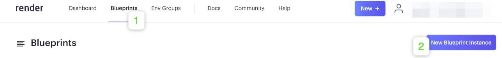
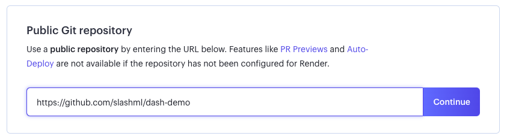
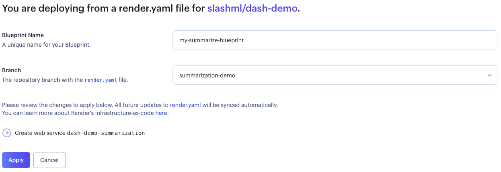
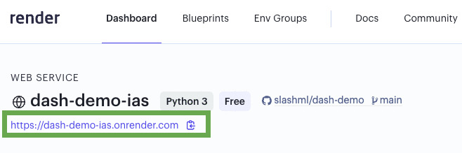

# Dash + Render Deployment

### Render

[Render](https://render.com/) is a unified cloud to build and run all your apps and websites with free TLS certificates, a global CDN, DDoS protection, private networks, and auto deploys from Git.

### Create Account

To deploy this demo on [Render](https://render.com/), you first need to login or create an account on [Render](https://render.com/) and navigate to your Render [Dashboard](https://dashboard.render.com/).

### Blueprint Instances

Then, naviagate to `Blueprints` &rarr; `New Blueprint Instance`

### Connect Repo

Under `Public Git repository`, set the URL to `https://github.com/slashml/dash-demo`

`Blueprint Name`: Give your Blueprint a unique name. 

`Branch`: Each demo is on a different branch. Select the demo that you want to deploy from the dropdown

### Create Blueprint

Once you have set `Blueprint Name` and `Branch`, press `Apply`

Wait for the blueprint to deploy the web-service, which you can see in the Dashboard.

### View Deployment

Navigate to [Dashboard](https://dashboard.render.com/) and click on your newly created service.

You can find the URL of the deployed web-service at the top of the page.

